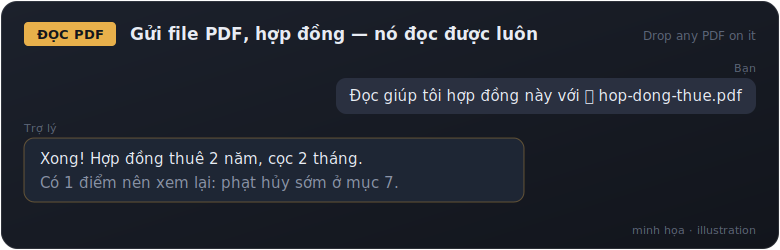
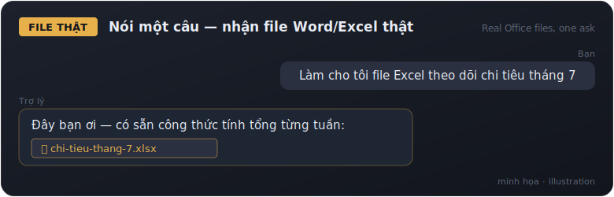
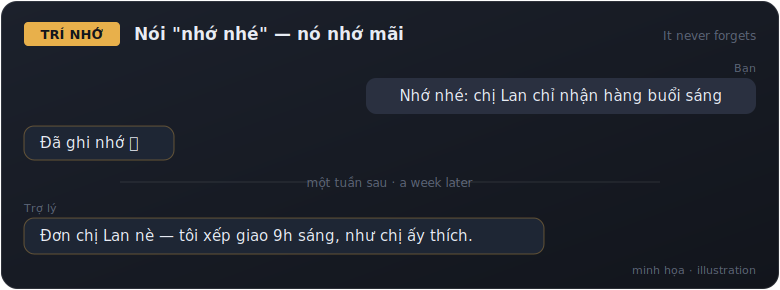
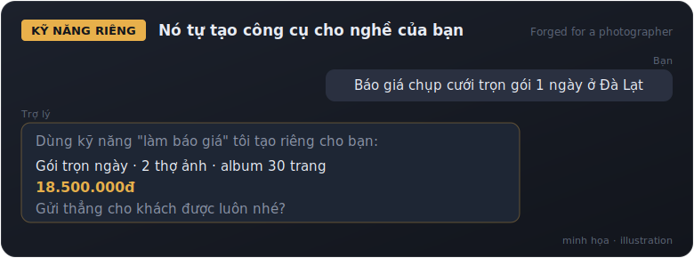
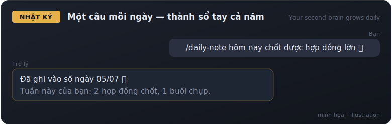
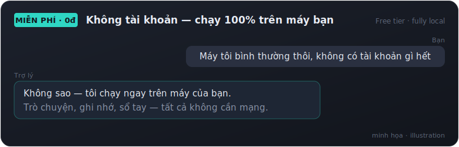

<div align="center">

<picture>
  <source media="(prefers-color-scheme: dark)" srcset="assets/logo-dark.svg">
  <source media="(prefers-color-scheme: light)" srcset="assets/logo-light.svg">
  
</picture>

# SoulDrop

**Drop a soul into any machine — your personal AI assistant, fully automatic.**
<br>
<sub><i>Thả một linh hồn vào bất kỳ máy nào — trợ lý AI cá nhân của bạn, tự động hoàn toàn.</i></sub>

<br>
<br>

[](https://github.com/kkitkai/souldrop/actions/workflows/validate.yml)
[](CHANGELOG.md)
[](LICENSE)


[](https://github.com/kkitkai/souldrop/pulls)

<br>

**English** · [Tiếng Việt](README.vi.md) · [ไทย](README.th.md) · [한국어](README.ko.md) · [中文](README.zh.md)

<br>


</div>

One command. A friendly interview (never a technical question). Out comes an assistant with its own name, personality, long-term memory, and a second brain — running on the engine that fits you, **paid or 100% free**.

> English and Tiếng Việt are the primary supported languages. Thai, Korean, and Chinese are fully supported; other languages work best-effort via the interview's "Other" option.

---

## 🚀 Install

The installer takes care of **everything** — including any helper tools it needs (git, Node...). You never have to install anything yourself first.

### 🖱️ Easiest way (Windows) — download 1 file, double-click

1. **[Download the installer here](https://raw.githubusercontent.com/kkitkai/souldrop/main/SoulDrop-Installer.bat)** — **right-click** the link → **"Save link as..."** → save it to your Desktop.
2. **Double-click** the downloaded `SoulDrop-Installer.bat`. That's it — the installer runs itself.
3. If Windows shows a blue SmartScreen warning: click **"More info"** → **"Run anyway"**. Honest note: that warning appears for *any* unsigned file downloaded from the internet — this one only runs the official install script below, and you can open it in Notepad and read it yourself.

*On a Mac? The file above is Windows-only — your easiest path is the one-paste command just below: copy it, paste it once, done.*

### ⌨️ One-paste command (if you're OK with PowerShell / Terminal)

**Windows** — open **PowerShell** (never done that? [see the illustrated guide below](#-complete-beginner-walkthrough)) and paste:

```powershell
irm https://raw.githubusercontent.com/kkitkai/souldrop/main/install/go.ps1 | iex
```

**macOS / Linux** — open **Terminal** (never done that? [see the illustrated guide below](#-complete-beginner-walkthrough)) and paste:

```bash
curl -fsSL https://raw.githubusercontent.com/kkitkai/souldrop/main/install/go.sh | bash
```

### Then

**Pro engine (Claude):**
1. Type `claude` and press Enter, log in when the browser opens (paid plan required).
2. Type `/onboard`, pick your language, and meet your new assistant — it even forges 3–5 custom skills for your profession before saying hello.
3. Then try it: **drop any PDF or contract on it — it reads it natively**, or say *"make me an Excel file"* — the installer added a documents pack that produces real Word/Excel/PowerPoint/PDF files (and, if you have Chrome, it can browse the web with you).

**Free engine (local):**
1. Double-click **SoulDrop** on your Desktop (Windows) or type `souldrop` in a new terminal.
2. Answer six friendly questions (your name, your work, your goal, its name...) — done. Everything runs on your machine; nothing leaves it.

## ✨ What can it do?

Everyday things, asked in plain chat. These cards are simplified illustrations of real conversations — not screenshots:

<table>
<tr>
<td></td>
<td></td>
</tr>
<tr>
<td></td>
<td></td>
</tr>
<tr>
<td></td>
<td></td>
</tr>
</table>

<!-- TODO(Nick): replace these illustration cards with real captured session
     screenshots/recordings (Vietnamese) once the demo sessions are recorded. -->

## 🧭 Complete beginner walkthrough

> Never used a "command line"? No problem — this section walks you through every step, with pictures. Take it slow. Pick your system: 🪟 Windows · 🍎 macOS · 🐧 Linux.

### 🪟 How to open PowerShell (Windows)


Small tip: in PowerShell, **right-click = paste**. Copy the install command above with the 📋 button (top-right of the code block), right-click the blue window, press Enter — done.

### 🍎 How to open Terminal (macOS)


The command to paste on a Mac (copy it with the 📋 button, top-right of the code block):

```bash
curl -fsSL https://raw.githubusercontent.com/kkitkai/souldrop/main/install/go.sh | bash
```

Small tip: on a Mac, **paste = Cmd ⌘ + V** (not Ctrl+V). If a dialog pops up asking to install the **"command line developer tools"**, click **Install** — that's Apple's official toolkit the installer needs; when it finishes, run the command above again.

### 🐧 Opening a terminal on Linux


Press **Ctrl + Alt + T** (most distros: Ubuntu, Mint...) — or find "Terminal" in your apps menu. Paste this command and press Enter (**paste inside a terminal = Ctrl + Shift + V**, not Ctrl+V):

```bash
curl -fsSL https://raw.githubusercontent.com/kkitkai/souldrop/main/install/go.sh | bash
```

Honest note: the installer **never runs sudo by itself**. If git is missing, it just prints the exact `sudo apt-get install -y git` line for **you to run yourself**, then you re-run the command above — transparent, and it never touches system privileges on its own.

### Two ways to use Claude — pick what fits you

Already **chatting with Claude in the Claude Desktop app**? Then you can use SoulDrop **right inside the app** — no terminal at all.

| | 🖥️ Claude Desktop — *easiest* | ⚡ Claude CLI — *the power version* |
|---|---|---|
| Best for | Beginners who already chat with Claude | Anyone who wants full power |
| Needs a terminal? | **No** | Yes (PowerShell / Terminal) |
| How to open | Open the Claude app → click the **Code** tab | Type `claude` in a terminal |
| Power | Full SoulDrop skills | Full + deeper automation |

**Way A — Claude Desktop (no terminal):**
1. Get the app at [claude.com/download](https://claude.com/download) and sign in (Pro/Max plan required).
2. Click the **Code** tab in the app's top bar, then pick **Local**.
3. Type these two commands into the prompt box (copy each line, paste, Enter):
   ```
   /plugin marketplace add kkitkai/souldrop
   /plugin install souldrop@souldrop
   ```
4. Type `/onboard` — pick your language and meet your own assistant. Done!

**Way B — Claude CLI (stronger for long-running work):** follow the Install section above → open a terminal → type `claude` → type `/onboard`.

### Installing Ollama by hand (Free engine — optional)

The SoulDrop installer **already installs Ollama for you** — this is only for people who prefer doing it themselves:

1. Go to [ollama.com/download](https://ollama.com/download) → download for Windows / Mac → install it like any normal app (Next, Next, Finish).
2. Open PowerShell / Terminal ([illustrated guide above](#-how-to-open-powershell-windows)) and pull the model that fits your RAM:

   | Your RAM | Type this | Download |
   |---|---|---|
   | 16 GB or more | `ollama pull llama3.1:8b` | ~4.9 GB |
   | 8–16 GB | `ollama pull llama3.2:3b` | ~2 GB |
   | Under 8 GB | `ollama pull llama3.2:1b` | ~1.3 GB |

   *Not sure how much RAM you have?* Press the Windows key → type `about` → Enter → look for **"Installed RAM"**.
3. Re-run the SoulDrop installer above — it will detect Ollama and continue with the remaining steps.

### 🎬 Video tutorials

<!-- TODO(Nick): drag the final .mp4 files into the GitHub web editor and paste
     the generated https://github.com/user-attachments/assets/... URLs on their
     own lines right below this comment — that is the ONLY form GitHub renders
     as an inline video player (repo-committed .mp4 files do NOT render).
     Masters + preview GIFs go in assets/media/ (see assets/media/README.md). -->

*Vietnamese video tutorials (with voice-over) are on their way — they will appear right here. Until then, the illustrated steps above cover the full install.*

## 🧠 Choose your engine

<p align="center">
  
</p>

SoulDrop separates the **brain** (who your assistant is — plain markdown files you own) from the **engine** (what runs it). Same soul, any engine:

| Engine | Cost | What you get |
|---|---|---|
| **Pro — [Claude Code](https://code.claude.com)** | Paid Claude plan (Pro/Max) | The smartest tier: full skills, **auto skill-forge** (it builds custom abilities for your profession), real Word/Excel/PowerPoint/PDF files, browsing via your Chrome, subagents |
| **Free — [Ollama](https://ollama.com) (local)** | **$0, no account** | A real assistant running 100% on your own computer: persona, memory, "remember ...", second brain. Private by default |
| Codex · Antigravity · OpenClaw | — | 🔜 planned |

You don't have to choose anything technical — the installer **detects Claude Code automatically**, and otherwise asks exactly one human question: *Free or Pro?*

## 📦 Requirements

- Windows 10 1809+ / macOS 13+ / Ubuntu 20.04+, internet for the install
- **Free engine:** nothing else. ~2–5 GB disk for the AI model (picked automatically to fit your RAM)
- **Pro engine:** a paid Claude subscription (Pro, Max, or Team) — [claude.ai](https://claude.ai)
- **Don't have Claude yet?** Start with a free 7-day Pro trial → [claude.ai/referral/QbA1I722cA](https://claude.ai/referral/QbA1I722cA) *(referral link — supports this project)*

## 🔁 One brain, many engines

The brain is **plain markdown — engines are interchangeable**: a persona file (who your assistant is), a memory bank (facts it saves, say *"remember ..."* anytime), and a second-brain note vault at `~/second-brain` shared by every engine. You can read, edit, back up, or move every file yourself. Spec: [`brain/`](brain/README.md) · adapter contract for new engines: [`adapters/`](adapters/README.md).

## 🧩 What's inside the Pro plugin

| Skill | What it does |
|---|---|
| `/onboard` | The interview that creates your personalized assistant + memory + custom skills + second brain — in English, Tiếng Việt, ไทย, 한국어, 中文, or your own language |
| `forge-skills` | **Auto-builds 3–5 custom skills for your profession and goal** — runs automatically at the end of `/onboard`; re-run anytime with `/forge-skills` or "my goals changed". For design/content professions it also adds 1–2 pro "taste" skills from the open-source [taste-skill](https://github.com/Leonxlnx/taste-skill) collection (MIT) |
| `/doctor` | **Health check** — verifies engine, plugin, profile, memory, second brain and extras, quietly fixes what it can, and prints one friendly report. Say "something broke" and it runs |
| `/uninstall` | Cleanly removes SoulDrop and its extras — your profile, memories and notes **always stay** |
| `create-skill` | Teach your assistant one new ability by describing it — it authors and installs the skill (same quality gate as the forge) |
| `remember` | Saves facts/preferences to your assistant's long-term memory |
| `recall` | Finds things you told it before |
| `learn-from-mistakes` | Turns your corrections into permanent rules |
| `daily-note` | Simple daily journal |
| `work-smart` | Makes the assistant plan before acting and avoid wasted steps |
| `personal` | Personal-assistant baseline: consistent persona, memory habits, honesty, safety boundaries |
| `leader` | For big tasks: plan, break down, delegate, verify, report one clean answer |
| `/setup-vault` | (Re)creates the second-brain note vault at `~/second-brain` — Obsidian-ready |
| `obsidian-markdown` · `obsidian-cli` | Write and organize vault notes properly (wikilinks, tags, safe file operations) |

The installer also adds an **everyday-tools pack** — all optional, all skipped silently if they can't install: Anthropic's official **documents pack** (your assistant makes real Word/Excel/PowerPoint/PDF files), **browsing power** via [chrome-devtools](https://github.com/ChromeDevTools/chrome-devtools-mcp) (only if Chrome is already on your machine — no account, no key), creative graphics skills, and smart memory. And PDF **reading** needs nothing at all — it's built in: just drop a PDF on your assistant.

## 🆓 What the Free engine gives you

The `souldrop` chat launcher (Desktop shortcut / terminal command): loads your assistant's soul, streams replies from a local model chosen to fit your computer (16 GB+ RAM → an 8B model, 8–16 GB → 3B, under 8 GB → 1B with an honest "it's basic" note), saves facts when you say *"remember ..."*, and writes the same second brain as the Pro tier. No skill-forge on this tier — small local models aren't reliable skill authors, so the core SoulDrop skills are folded into the persona instead. Upgrade to Pro anytime by re-running the installer; your brain comes with you.

## 📔 Your second brain

Onboarding creates a note vault at `~/second-brain` — plain markdown files your assistant reads and writes (daily notes, projects, people, ideas). Open the folder in the free [Obsidian](https://obsidian.md) app ("Open folder as vault") to browse it visually — the Pro installer even tries to install Obsidian for you, and everything still works as plain files without it. The Pro installer also tries an optional "smart memory" upgrade (the open-source [agentmemory](https://github.com/rohitg00/agentmemory) plugin); if it can't, your assistant simply keeps remembering via files.

## 🧹 Uninstall

Easiest way: inside your assistant, type **`/uninstall`** — it confirms once, removes SoulDrop and the extras it installed, and leaves your brain files untouched. Manual one-liner (works in PowerShell and Terminal):

```
claude plugin uninstall souldrop ; claude plugin marketplace remove souldrop
```

**What stays — on purpose:** your brain. `~/.claude/CLAUDE.md` (profile), `~/.claude/memory/` (memories), and `~/second-brain` (notes) are plain files that belong to you — SoulDrop never auto-deletes them. Delete those folders yourself if you want everything gone. Free tier: delete the `souldrop` folder in your home folder and the Desktop shortcut; remove Ollama like any normal app if you no longer want it.

## ❓ FAQ

**Is this official Anthropic or Ollama software?**
No. SoulDrop is an independent starter kit. It installs Claude Code and Ollama only by calling their own official installers, then adds the SoulDrop brain on top. See [NOTICE](NOTICE).

**Is the free version really free?**
Yes. The local engine (Ollama) and the models are open source and run entirely on your computer. No account, no subscription, no hidden cost — just disk space and your own hardware.

**Is the install script safe?**
Yes — and you don't have to trust us: [read `install/go.ps1`](install/go.ps1) and [`install/go.sh`](install/go.sh) yourself. They only call official installers, register this repo as a plugin marketplace, and set up the launcher. Windows SmartScreen or antivirus may warn about any script from the internet — that's normal for this install method.

**I ran it twice by accident.**
Totally fine — the script is safe to re-run. It skips whatever is already installed.

**Can I change my assistant later?**
Yes. Run `/onboard` again (Pro) or `souldrop -Reset` / `souldrop --reset` (Free) anytime. Your old profile is backed up first, never deleted.

**Does it collect my data?**
No. Everything stays on your own machine — `~/.claude/` on Pro, `~/souldrop-brain/` on Free. On the free tier not even the AI leaves your computer.

**Old links say `claude-easy-install`?**
Same project — SoulDrop is the new name since v0.4.0. Old GitHub URLs redirect automatically.

## 📄 License

MIT — see [LICENSE](LICENSE). Claude Code is Anthropic's software and Ollama is Ollama's, each installed via their official installers; see [NOTICE](NOTICE).

---

<div align="center">


**SoulDrop** — one brain, any engine.

<sub>MIT © SK Production · <a href="LICENSE">LICENSE</a> · <a href="NOTICE">NOTICE</a></sub>

</div>
