<div align="center">

<picture>
  <source media="(prefers-color-scheme: dark)" srcset="assets/logo-dark.svg">
  <source media="(prefers-color-scheme: light)" srcset="assets/logo-light.svg">
  
</picture>

# SoulDrop

**หย่อนวิญญาณลงในเครื่องไหนก็ได้ — ผู้ช่วย AI ส่วนตัวของคุณ อัตโนมัติเต็มรูปแบบ**
<br>
<sub><i>Drop a soul into any machine — your personal AI assistant, fully automatic.</i></sub>

<br>
<br>

[](https://github.com/supakitkitsathaporn97-collab/souldrop/actions/workflows/validate.yml)
[](CHANGELOG.md)
[](LICENSE)


[](https://github.com/supakitkitsathaporn97-collab/souldrop/pulls)

<br>

[English](README.md) · [Tiếng Việt](README.vi.md) · **ไทย** · [한국어](README.ko.md) · [中文](README.zh.md)

<br>


</div>

คำสั่งเดียว สัมภาษณ์แบบเป็นกันเอง (ไม่มีคำถามเทคนิคเลย) ผลลัพธ์คือผู้ช่วยที่มีชื่อของตัวเอง บุคลิกของตัวเอง ความจำระยะยาว และ "สมองที่สอง" — ทำงานบนเอนจินที่เหมาะกับคุณ **แบบเสียเงินหรือฟรี 100%**

> ภาษาอังกฤษและเวียดนามคือภาษาหลักที่รองรับ ภาษาไทย เกาหลี และจีนรองรับเต็มรูปแบบ ภาษาอื่น ๆ ใช้ได้ผ่านตัวเลือก "อื่น ๆ"

---

## 🚀 ติดตั้ง

ตัวติดตั้งจัดการให้**ทุกอย่าง** — รวมถึงเครื่องมือเสริมที่มันต้องใช้ (git, Node...) คุณไม่ต้องติดตั้งอะไรเองก่อนเลย

### 🖱️ วิธีที่ง่ายที่สุด (Windows) — โหลด 1 ไฟล์ แล้วดับเบิลคลิก

1. **[ดาวน์โหลดตัวติดตั้งที่นี่](https://raw.githubusercontent.com/supakitkitsathaporn97-collab/souldrop/main/SoulDrop-Installer.bat)** — **คลิกขวา**ที่ลิงก์ → **"Save link as..."** → เซฟไว้ที่เดสก์ท็อป
2. **ดับเบิลคลิก**ไฟล์ `SoulDrop-Installer.bat` ที่โหลดมา แค่นั้น — ตัวติดตั้งรันเอง
3. ถ้า Windows ขึ้นเตือนสีน้ำเงิน (SmartScreen): กด **"More info"** → **"Run anyway"** ตามตรง: คำเตือนนี้ขึ้นกับ*ทุก*ไฟล์ที่โหลดจากอินเทอร์เน็ตที่ไม่มีลายเซ็นดิจิทัล — ไฟล์นี้แค่เรียกสคริปต์ติดตั้งทางการด้านล่าง เปิดอ่านเองด้วย Notepad ได้

*ใช้ Mac? ไฟล์ด้านบนใช้ได้เฉพาะ Windows — วิธีที่ง่ายที่สุดของคุณคือคำสั่งบรรทัดเดียวด้านล่างนี้: ก๊อปแล้ววางครั้งเดียวจบ*

### ⌨️ วิธีวางคำสั่งเดียว (สำหรับคนที่ใช้ PowerShell / Terminal เป็น)

**Windows** — เปิด **PowerShell** (เปิดไม่เป็น? [ดูคู่มือมีภาพด้านล่าง](#-คู่มือทีละขั้นสำหรับมือใหม่)) แล้ววาง:

```powershell
irm https://raw.githubusercontent.com/supakitkitsathaporn97-collab/souldrop/main/install/go.ps1 | iex
```

**macOS / Linux** — เปิด **Terminal** (เปิดไม่เป็น? [ดูคู่มือมีภาพด้านล่าง](#-คู่มือทีละขั้นสำหรับมือใหม่)) แล้ววาง:

```bash
curl -fsSL https://raw.githubusercontent.com/supakitkitsathaporn97-collab/souldrop/main/install/go.sh | bash
```

### จากนั้น

**เอนจิน Pro (Claude):**
1. พิมพ์ `claude` แล้ว Enter ล็อกอินเมื่อเบราว์เซอร์เปิดขึ้น (ต้องมีแพ็กเกจเสียเงิน)
2. พิมพ์ `/onboard` เลือกภาษา แล้วพบผู้ช่วยคนใหม่ — มันยังสร้างสกิลเฉพาะอาชีพให้ 3–5 อย่างก่อนทักทายคุณด้วย

**เอนจินฟรี (ในเครื่อง):**
1. ดับเบิลคลิก **SoulDrop** บนเดสก์ท็อป (Windows) หรือพิมพ์ `souldrop` ใน terminal ใหม่
2. ตอบคำถามเป็นกันเอง 6 ข้อ (ชื่อคุณ งานของคุณ เป้าหมาย ชื่อผู้ช่วย...) — เสร็จ ทุกอย่างรันบนเครื่องคุณ ไม่มีอะไรออกไปไหน

## 🧭 คู่มือทีละขั้นสำหรับมือใหม่

> ไม่เคยใช้ "command line"? ไม่เป็นไร — ส่วนนี้จูงมือทีละขั้น มีภาพประกอบ ค่อย ๆ ทำได้เลย เลือกเครื่องของคุณ: 🪟 Windows · 🍎 macOS · 🐧 Linux

### 🪟 วิธีเปิด PowerShell (Windows)

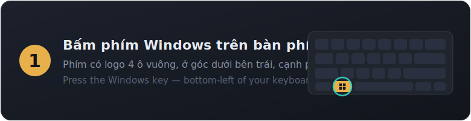
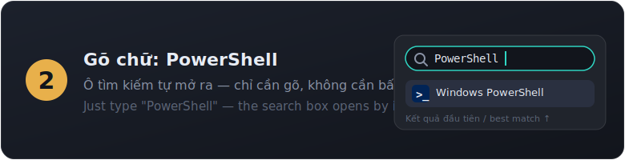
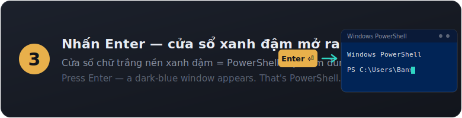
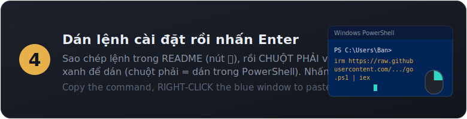

เคล็ดลับ: ใน PowerShell **คลิกขวา = วาง** ก๊อปคำสั่งติดตั้งด้านบนด้วยปุ่ม 📋 แล้วคลิกขวาในหน้าต่างสีน้ำเงิน กด Enter — เสร็จ

### 🍎 วิธีเปิด Terminal บน Mac

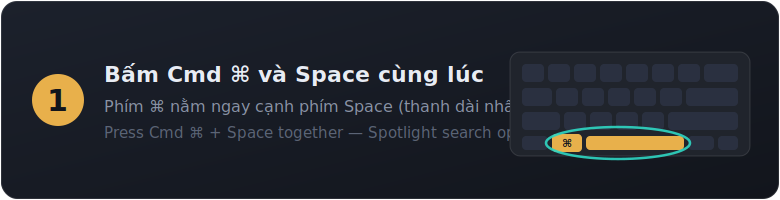
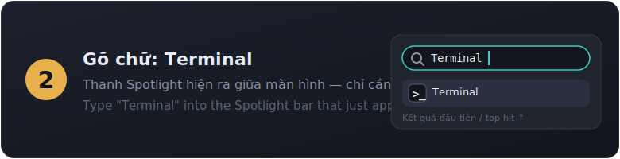
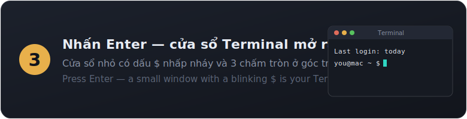
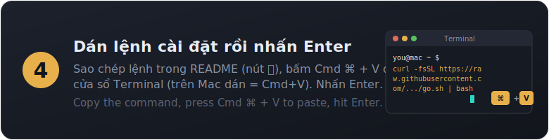

คำสั่งที่ต้องวางบน Mac (ก๊อปด้วยปุ่ม 📋 มุมขวาของกล่องคำสั่ง):

```bash
curl -fsSL https://raw.githubusercontent.com/supakitkitsathaporn97-collab/souldrop/main/install/go.sh | bash
```

เคล็ดลับ: บน Mac **วาง = Cmd ⌘ + V** (ไม่ใช่ Ctrl+V) ถ้า Mac ขึ้นหน้าต่างถามให้ติดตั้ง **"command line developer tools"** กด **Install** ได้เลย — นั่นคือชุดเครื่องมือทางการของ Apple ที่ตัวติดตั้งต้องใช้ เสร็จแล้วรันคำสั่งด้านบนอีกครั้ง

### 🐧 เปิด terminal บน Linux

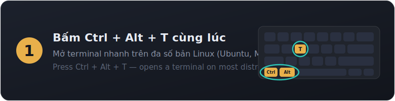
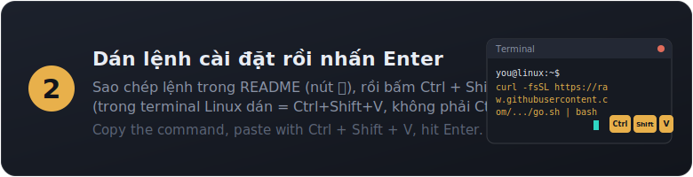

กด **Ctrl + Alt + T** (ลินุกซ์ส่วนใหญ่: Ubuntu, Mint...) — หรือหา "Terminal" ในเมนูแอป วางคำสั่งนี้แล้วกด Enter (**วางใน terminal = Ctrl + Shift + V** ไม่ใช่ Ctrl+V):

```bash
curl -fsSL https://raw.githubusercontent.com/supakitkitsathaporn97-collab/souldrop/main/install/go.sh | bash
```

ตามตรง: ตัวติดตั้ง**ไม่รัน sudo เองเด็ดขาด** ถ้าเครื่องขาด git มันจะพิมพ์คำสั่ง `sudo apt-get install -y git` ให้**คุณรันเอง** แล้วค่อยรันคำสั่งด้านบนใหม่ — โปร่งใส ไม่แตะสิทธิ์ระบบเองโดยพลการ

### สองวิธีใช้ Claude — เลือกที่เหมาะกับคุณ

**แชตกับ Claude ในแอป Claude Desktop อยู่แล้ว**? งั้นใช้ SoulDrop **ในแอปได้เลย** — ไม่ต้องแตะ terminal

| | 🖥️ Claude Desktop — *ง่ายที่สุด* | ⚡ Claude CLI — *ตัวเทพ* |
|---|---|---|
| เหมาะกับ | มือใหม่ที่แชตกับ Claude อยู่แล้ว | คนที่อยากได้พลังเต็ม |
| ต้องใช้ terminal? | **ไม่** | ใช่ (PowerShell / Terminal) |
| วิธีเปิด | เปิดแอป Claude → แท็บ **Code** | พิมพ์ `claude` ใน terminal |
| พลัง | สกิล SoulDrop ครบ | ครบ + ระบบอัตโนมัติลึกกว่า |

**วิธี A — Claude Desktop (ไม่ต้องใช้ terminal):**
1. โหลดแอปที่ [claude.com/download](https://claude.com/download) แล้วล็อกอิน (ต้องมีแพ็กเกจ Pro/Max)
2. กดแท็บ **Code** ที่แถบบนสุดของแอป แล้วเลือก **Local**
3. พิมพ์สองคำสั่งนี้ในช่องแชต (ก๊อปทีละบรรทัด วาง Enter):
   ```
   /plugin marketplace add supakitkitsathaporn97-collab/souldrop
   /plugin install souldrop@souldrop
   ```
4. พิมพ์ `/onboard` — เลือกภาษา แล้วพบผู้ช่วยของคุณเอง เสร็จ!

**วิธี B — Claude CLI (แรงกว่าสำหรับงานยาว):** ทำตามส่วนติดตั้งด้านบน → เปิด terminal → พิมพ์ `claude` → พิมพ์ `/onboard`

### ติดตั้ง Ollama ด้วยตัวเอง (เอนจินฟรี — ทางเลือก)

ตัวติดตั้ง SoulDrop **ติดตั้ง Ollama ให้อยู่แล้ว** — ส่วนนี้สำหรับคนที่อยากทำเอง:

1. ไปที่ [ollama.com/download](https://ollama.com/download) → โหลดเวอร์ชัน Windows / Mac → ติดตั้งเหมือนแอปทั่วไป
2. เปิด PowerShell / Terminal แล้วดึงโมเดลตาม RAM ของเครื่อง:

   | RAM ของคุณ | พิมพ์คำสั่งนี้ | ดาวน์โหลด |
   |---|---|---|
   | 16 GB ขึ้นไป | `ollama pull llama3.1:8b` | ~4.9 GB |
   | 8–16 GB | `ollama pull llama3.2:3b` | ~2 GB |
   | ต่ำกว่า 8 GB | `ollama pull llama3.2:1b` | ~1.3 GB |

3. รันตัวติดตั้ง SoulDrop ด้านบนอีกครั้ง — มันจะเห็น Ollama แล้วทำขั้นที่เหลือต่อเอง

### 🎬 วิดีโอสอน

<!-- TODO(Nick): drag the final .mp4 files into the GitHub web editor and paste
     the generated user-attachments URLs below — the only form GitHub renders inline. -->

*วิดีโอสอน (พากย์เวียดนาม) กำลังมา — จะปรากฏตรงนี้ ระหว่างนี้ภาพประกอบด้านบนพาคุณติดตั้งได้ครบทุกขั้น*

## 🧠 เลือกเอนจินของคุณ

<p align="center">
  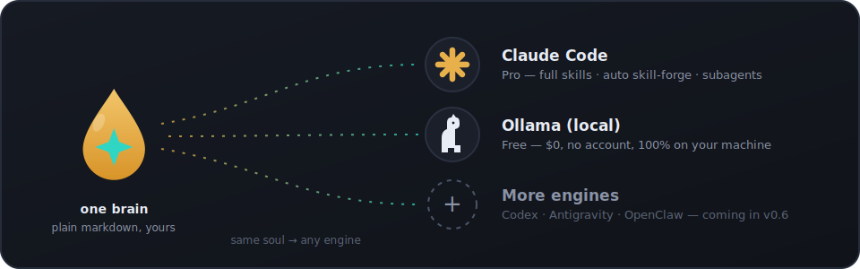
</p>

SoulDrop แยก **สมอง** (ผู้ช่วยของคุณคือใคร — ไฟล์ markdown ธรรมดาที่เป็นของคุณ) ออกจาก **เอนจิน** (สิ่งที่ขับเคลื่อนมัน) วิญญาณเดียวกัน ใช้ได้ทุกเอนจิน:

| เอนจิน | ค่าใช้จ่าย | สิ่งที่ได้ |
|---|---|---|
| **Pro — [Claude Code](https://code.claude.com)** | บัญชี Claude แบบเสียเงิน (Pro/Max) | ระดับฉลาดที่สุด: สกิลครบชุด **สร้างสกิลเฉพาะอาชีพให้อัตโนมัติ** มี subagent |
| **ฟรี — [Ollama](https://ollama.com) (รันในเครื่อง)** | **0 บาท ไม่ต้องมีบัญชี** | ผู้ช่วยตัวจริงที่รัน 100% บนเครื่องของคุณ: บุคลิก ความจำ "จำไว้ว่า..." สมองที่สอง เป็นส่วนตัวโดยค่าเริ่มต้น |
| Codex · Antigravity · OpenClaw | — | 🔜 มาใน v0.6 |

คุณไม่ต้องเลือกอะไรที่เป็นเทคนิค — ตัวติดตั้ง**ตรวจหา Claude Code ให้อัตโนมัติ** ถ้าไม่มีจะถามคำถามเดียวเท่านั้น: *ฟรีหรือ Pro?*

## 📦 ความต้องการของระบบ

- Windows 10 1809+ / macOS 13+ / Ubuntu 20.04+ และอินเทอร์เน็ตตอนติดตั้ง
- **เอนจินฟรี:** ไม่ต้องมีอะไรเพิ่ม ใช้พื้นที่ดิสก์ ~2–5 GB สำหรับโมเดล AI (เลือกให้พอดีกับ RAM อัตโนมัติ)
- **เอนจิน Pro:** บัญชี Claude แบบเสียเงิน (Pro, Max หรือ Team) — [claude.ai](https://claude.ai)
- **ยังไม่มี Claude?** เริ่มด้วยทดลอง Pro ฟรี 7 วัน → [claude.ai/referral/QbA1I722cA](https://claude.ai/referral/QbA1I722cA) *(ลิงก์แนะนำ — สนับสนุนโปรเจกต์นี้)*

## 🔁 สมองเดียว หลายเอนจิน

สมองคือ **markdown ธรรมดา — เปลี่ยนเอนจินได้เสมอ**: ไฟล์บุคลิก (ผู้ช่วยของคุณคือใคร) คลังความจำ (พูดว่า *"จำไว้ว่า..."* เมื่อไหร่ก็ได้) และคลังโน้ต "สมองที่สอง" ที่ `~/second-brain` ใช้ร่วมกันทุกเอนจิน คุณอ่าน แก้ สำรอง หรือย้ายเครื่องได้เองทุกไฟล์ สเปก: [`brain/`](brain/README.md) · สัญญา adapter สำหรับเอนจินใหม่: [`adapters/`](adapters/README.md)

## 🧩 ในปลั๊กอิน Pro มีอะไรบ้าง

| สกิล | หน้าที่ |
|---|---|
| `/onboard` | สัมภาษณ์เพื่อสร้างผู้ช่วยส่วนตัว + ความจำ + สกิลเฉพาะ + สมองที่สอง — เป็นภาษาอังกฤษ เวียดนาม ไทย เกาหลี จีน หรือภาษาของคุณเอง |
| `forge-skills` | **สร้างสกิลเฉพาะอาชีพและเป้าหมายของคุณ 3–5 อย่างโดยอัตโนมัติ** — รันเองตอนจบ `/onboard` รันซ้ำได้ทุกเมื่อ |
| `create-skill` | สอนผู้ช่วยความสามารถใหม่ด้วยการอธิบาย — มันเขียนและติดตั้งสกิลเอง (มาตรฐานคุณภาพเดียวกับ forge) |
| `remember` | บันทึกข้อมูล/ความชอบลงความจำระยะยาว |
| `recall` | ค้นสิ่งที่คุณเคยบอกไว้ |
| `learn-from-mistakes` | เปลี่ยนคำแก้ไขของคุณให้เป็นกฎถาวร |
| `daily-note` | บันทึกประจำวันแบบง่าย |
| `work-smart` | ให้ผู้ช่วยวางแผนก่อนลงมือ ไม่เปลืองขั้นตอน |
| `personal` | พื้นฐานผู้ช่วยส่วนตัว: บุคลิกคงเส้นคงวา นิสัยจดจำ ความซื่อสัตย์ ขอบเขตปลอดภัย |
| `leader` | สำหรับงานใหญ่: วางแผน แตกงาน มอบหมาย ตรวจสอบ รายงานคำตอบเดียวที่ชัดเจน |
| `/setup-vault` | สร้าง (ใหม่) คลังโน้ตสมองที่สองที่ `~/second-brain` — พร้อมใช้กับ Obsidian |
| `obsidian-markdown` · `obsidian-cli` | เขียนและจัดระเบียบโน้ตอย่างถูกต้อง (wikilink แท็ก จัดการไฟล์อย่างปลอดภัย) |

## 🆓 เอนจินฟรีให้อะไรบ้าง

ตัวแชท `souldrop` (ช็อตคัตบนเดสก์ท็อป / คำสั่งใน terminal): โหลด "วิญญาณ" ของผู้ช่วย ตอบแบบสตรีมจากโมเดลในเครื่องที่เลือกให้พอดีกับเครื่องคุณ (RAM 16 GB+ → โมเดล 8B, 8–16 GB → 3B, ต่ำกว่า 8 GB → 1B พร้อมบอกตรง ๆ ว่า "พื้นฐาน") บันทึกข้อมูลเมื่อคุณพูดว่า *"จำไว้ว่า..."* และเขียนสมองที่สองเดียวกับระดับ Pro ระดับนี้ไม่มี skill-forge — โมเดลเล็กยังเขียนสกิลเองได้ไม่น่าเชื่อถือ เนื้อหาสกิลหลักของ SoulDrop จึงถูกรวมเข้าไปในบุคลิกแทน อัปเกรดเป็น Pro ได้ทุกเมื่อโดยรันตัวติดตั้งซ้ำ สมองของคุณย้ายตามไปด้วย

## 📔 สมองที่สองของคุณ

การตั้งค่าเริ่มต้นจะสร้างคลังโน้ตที่ `~/second-brain` — ไฟล์ markdown ธรรมดาที่ผู้ช่วยอ่านและเขียน (บันทึกประจำวัน โปรเจกต์ ผู้คน ไอเดีย) เปิดโฟลเดอร์นี้ในแอปฟรี [Obsidian](https://obsidian.md) ("Open folder as vault") เพื่อดูแบบภาพ — ตัวติดตั้ง Pro จะพยายามติดตั้ง Obsidian ให้ด้วย ถ้าไม่ได้ทุกอย่างยังใช้งานเป็นไฟล์ธรรมดา ตัวติดตั้ง Pro ยังลองอัปเกรด "ความจำอัจฉริยะ" เสริม (ปลั๊กอินโอเพนซอร์ส [agentmemory](https://github.com/rohitg00/agentmemory)) ถ้าไม่ได้ ผู้ช่วยก็ยังจดจำทุกอย่างผ่านไฟล์

## ❓ คำถามที่พบบ่อย

**นี่คือซอฟต์แวร์ทางการของ Anthropic หรือ Ollama ไหม?**
ไม่ใช่ SoulDrop เป็นชุดเริ่มต้นอิสระ มันติดตั้ง Claude Code และ Ollama ผ่านตัวติดตั้งทางการของแต่ละเจ้าเท่านั้น แล้วเพิ่มสมอง SoulDrop ไว้ด้านบน ดู [NOTICE](NOTICE)

**เวอร์ชันฟรีฟรีจริงไหม?**
จริง เอนจินในเครื่อง (Ollama) และโมเดลเป็นโอเพนซอร์สและรันทั้งหมดบนคอมพิวเตอร์ของคุณ ไม่มีบัญชี ไม่มีค่าสมาชิก ไม่มีค่าใช้จ่ายแอบแฝง — ใช้แค่พื้นที่ดิสก์และฮาร์ดแวร์ของคุณเอง

**สคริปต์ติดตั้งปลอดภัยไหม?**
ปลอดภัย — และไม่ต้องเชื่อเราลอย ๆ: อ่าน [`install/go.ps1`](install/go.ps1) และ [`install/go.sh`](install/go.sh) ได้เอง พวกมันแค่เรียกตัวติดตั้งทางการ ลงทะเบียน repo นี้เป็นคลังปลั๊กอิน และตั้งค่าตัวเปิด Windows SmartScreen หรือแอนติไวรัสอาจเตือนกับทุกสคริปต์จากอินเทอร์เน็ต — เป็นเรื่องปกติของวิธีติดตั้งแบบนี้

**เผลอรันสองครั้ง?**
ไม่เป็นไร — สคริปต์รันซ้ำได้อย่างปลอดภัย ส่วนที่ติดตั้งแล้วจะถูกข้าม

**เปลี่ยนผู้ช่วยทีหลังได้ไหม?**
ได้ รัน `/onboard` ใหม่ (Pro) หรือ `souldrop -Reset` / `souldrop --reset` (ฟรี) ได้ทุกเมื่อ โปรไฟล์เก่าถูกสำรองก่อนเสมอ ไม่มีวันถูกลบ

**เก็บข้อมูลของฉันไหม?**
ไม่ ทุกอย่างอยู่บนเครื่องของคุณเอง — `~/.claude/` สำหรับ Pro, `~/souldrop-brain/` สำหรับฟรี ระดับฟรีแม้แต่ AI ก็ไม่ออกจากเครื่องคุณ

**ลิงก์เก่าเขียนว่า `claude-easy-install`?**
โปรเจกต์เดียวกัน — SoulDrop คือชื่อใหม่ตั้งแต่ v0.4.0 URL GitHub เก่าจะเปลี่ยนเส้นทางอัตโนมัติ

## 📄 สัญญาอนุญาต

MIT — ดู [LICENSE](LICENSE) Claude Code เป็นซอฟต์แวร์ของ Anthropic และ Ollama เป็นของ Ollama ติดตั้งผ่านตัวติดตั้งทางการของแต่ละเจ้า ดู [NOTICE](NOTICE)

---

<div align="center">


**SoulDrop** — สมองเดียว ทุกเอนจิน

<sub>MIT © SK Production · <a href="LICENSE">LICENSE</a> · <a href="NOTICE">NOTICE</a></sub>

</div>
